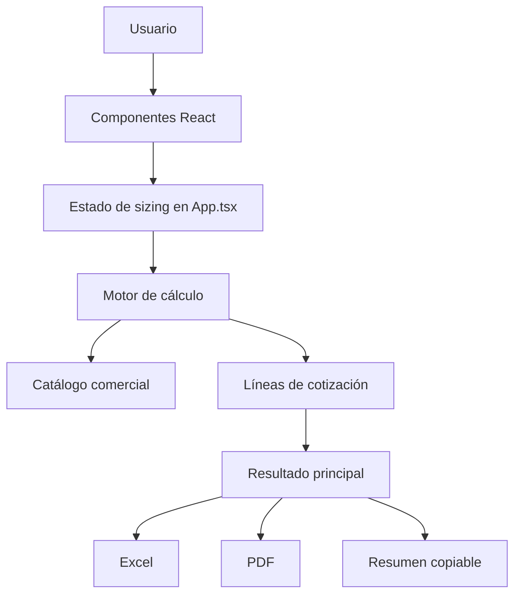

# Arquitectura

La aplicación es una SPA estática construida con React, TypeScript y Vite. No usa backend en el flujo actual. Toda la lógica comercial se mantiene fuera de los componentes visuales.

## Flujo general

## Estado principal

`src/App.tsx` mantiene el estado del escenario: datos generales, modalidad, ediciones, inventario, add-ons, ingesta, logs, Synthetic y datos Self-Hosted. Con `useMemo` calcula inventario, ingesta, logs, Synthetic, recomendaciones y líneas de cotización.

## Componentes principales

- `src/components/GeneralInfo.tsx`: datos del cliente u oportunidad.
- `src/components/ExampleCards.tsx`: ejemplos precargados.
- `src/components/DeploymentModeCards.tsx`: selección SaaS o Self-Hosted.
- `src/components/EditionSelection.tsx`: explicación y selección Standard/Essentials.
- `src/components/MvsDefinition.tsx`: definición de MVS y qué contar.
- `src/components/DistributedInventory.tsx`: inventario a monitorear.
- `src/components/AddOnToggles.tsx`: activación de capacidades SaaS.
- `src/components/IngestCalculator.tsx`: ingesta serverless/OpenTelemetry.
- `src/components/LogsCalculator.tsx`: Logs in Context.
- `src/components/SyntheticCalculator.tsx`: Synthetic RU.
- `src/components/SelfHostedSizing.tsx`: datos técnicos para Self-Hosted.
- `src/components/ValidationPanel.tsx`: validaciones y recomendaciones.
- `src/components/ResultOverview.tsx`: resultado ejecutivo.
- `src/components/QuoteSummary.tsx`: Part Numbers a cotizar.
- `src/components/ExportActions.tsx`: Excel, PDF, copiar resumen y limpiar.

## Tipos

`src/types/sizing.ts` define los tipos del dominio: modalidad, inventario, add-ons, ingesta, logs, Synthetic, resultados, líneas de cotización y recomendaciones.

## Catálogo comercial

`src/rules/instanaRules.ts` centraliza mínimos, cuotas, bloques, Part Numbers, unidades comerciales y estado de validación. Los datos pendientes se marcan como `Pendiente de validación comercial`.

## Motor de cálculo

`src/utils/calculations.ts` contiene las fórmulas:

- `calculateInventory` para MVS declarados/licenciados.
- `calculateIngest` para cuota incluida, agentes, serverless y Data Ingest.
- `calculateLogs` para retención y unidades de Logs.
- `calculateSynthetic` para RU y unidades Synthetic.
- `buildQuoteLines` para líneas finales con Part Numbers.
- `buildRecommendations` para recomendaciones y validaciones.

## Reporting

`src/utils/reporting.ts` construye textos ejecutivos compartidos por UI, Excel, PDF y copiar resumen.

## Excel

`src/utils/exportExcel.ts` usa ExcelJS para generar un XLSX real con hojas condicionales. No crea hojas sin información aplicable ni filas con cantidad cero.

## PDF

`src/utils/exportPdf.ts` genera un reporte PDF desde el navegador sin backend. El reporte prioriza recomendación, Part Numbers y advertencias antes del detalle técnico.

## Pruebas

- Unitarias: `src/utils/calculations.test.ts` con Vitest.
- E2E: `tests/e2e/instana-sizing-advisor.spec.ts` con Playwright.

Las pruebas cubren reglas de MVS, mínimos, serverless, Data Ingest, Logs, Synthetic, Self-Hosted, Excel, PDF, copiar resumen, limpiar y responsive.
