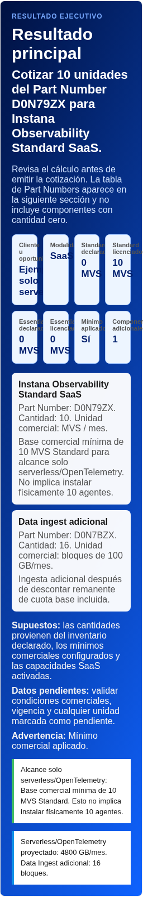

# Guía de usuario

Esta guía explica cómo utilizar IBM Instana Observability – Calculadora comercial de licenciamiento. La herramienta entrega una estimación referencial; antes de cotizar, valida Part Numbers, cantidades, unidades comerciales, condiciones y vigencia contra CPQ.

## 1. Objetivo

La aplicación ayuda a estimar licencias y componentes de IBM Instana Observability para escenarios SaaS y Self-Hosted. El resultado principal muestra qué cotizar, con cantidades, unidades comerciales, explicación y advertencias.

## 2. Selección SaaS o Self-Hosted

Selecciona la modalidad al inicio del recorrido.

- IBM Instana SaaS: IBM administra la plataforma. Puedes calcular MVS, ingesta adicional, Logs in Context y Synthetic Managed PoP.
- IBM Instana Self-Hosted: Instana se instala en infraestructura del cliente. La calculadora estima licencias MVS y recopila datos para sizing técnico; no cotiza add-ons SaaS.

## 3. Ejemplos precargados

Los ejemplos cargan datos ficticios para revisar el flujo y luego editarlos:

- SaaS Standard · 23 MVS.
- SaaS Standard + Essentials.
- SaaS · Solo serverless.
- SaaS · Agentes + serverless.
- Self-Hosted.

Usa estos ejemplos para explicar el cálculo sin utilizar datos reales de clientes.

## 4. Standard y Essentials

Standard aplica cuando se requiere APM y observabilidad completa: transacciones, tiempos de respuesta, errores, servicios, dependencias, bases de datos e infraestructura.

Essentials aplica cuando el alcance es principalmente monitoreo de infraestructura: disponibilidad, CPU, memoria, disco, red y estado del servidor, sin seguimiento detallado de transacciones.

No dupliques la misma infraestructura entre Standard y Essentials.

## 5. MVS

MVS significa Managed Virtual Server. Es la unidad usada para contar infraestructura monitoreada.

Se cuenta:

- 1 servidor físico = 1 MVS.
- 1 servidor virtual = 1 MVS.
- 1 worker node = 1 MVS.

No se ingresan sistemas operativos, nubes o ubicaciones como campos separados porque pueden duplicar el conteo.

## 6. Servidores físicos

Cuenta equipos dedicados con sistema operativo, por ejemplo Linux, Windows, AIX, Solaris u otro sistema soportado, donde corren workloads monitoreados.

## 7. Servidores virtuales

Cuenta máquinas virtuales en VMware, Hyper-V, IBM Cloud, AWS, Azure, Google Cloud u otra nube.

## 8. Worker nodes

Cuenta worker nodes de Kubernetes, OpenShift, AKS, EKS o GKE donde se ejecutan aplicaciones. No cuentes pods de forma individual.

## 9. Qué no contar

No cuentes pods, contenedores, aplicaciones, usuarios, transacciones, switches, routers, firewalls, balanceadores ni appliances que no sean servidores con sistema operativo monitoreado.

## 10. Mínimo comercial

La regla configurada aplica un mínimo comercial de 10 MVS cuando una edición tiene más de 0 y menos de 10 MVS declarados.

Ejemplo: si se declaran 5 MVS Standard, se licencian 10 MVS Standard. Si se declaran 23 MVS Standard, se licencian 23.

## 11. Solo serverless/OpenTelemetry

Usa esta opción cuando no existen servidores físicos, virtuales ni worker nodes con agente, pero sí existe telemetría desde AWS Lambda, Azure Functions, Cloud Run, Azure Web Apps, OpenTelemetry Collector u otra fuente.

Si hay volumen de telemetría mayor a cero, la herramienta considera una base comercial mínima de 10 MVS Standard. Esto no significa instalar físicamente 10 agentes.

Ejemplo con reglas configuradas: 10 MVS Standard generan cuota base; la telemetría proyectada se compara contra esa cuota y solo el exceso genera Data Ingest adicional.

## 12. Agentes más serverless

Cuando hay MVS con agentes y también telemetría serverless/OpenTelemetry:

1. Se calcula cuota incluida por MVS licenciados.
2. Se estima consumo de agentes reales según el porcentaje configurado.
3. Se obtiene cuota disponible.
4. La telemetría adicional se descuenta contra la cuota disponible.
5. Solo el exceso se convierte en bloques de Data Ingest.

El porcentaje de agentes usa 80% como referencia inicial cuando no hay medición real.

## 13. Data Ingest

Data Ingest adicional aplica solo a SaaS y solo si el add-on está activo. El catálogo actual usa bloques de 100 GB/mes y Part Number `D0N7BZX`.

Fórmula resumida: exceso = máximo entre 0 y telemetría proyectada menos cuota disponible. Unidades = redondeo hacia arriba del exceso dividido por 100 GB.

## 14. Comparación de 50 MVS

Cuando hay serverless/OpenTelemetry y menos de 50 MVS Standard licenciados, la herramienta puede mostrar una comparación de escenario de 50 MVS. La alternativa no cambia la cotización hasta confirmarla explícitamente.

## 15. Logs in Context

Logs aplica solo a SaaS y solo si el add-on está activo.

- 7 días: incluido, sin licencia adicional.
- 30, 60 o 90 días: retención extendida por bloques de 1 TB mensual.

Ejemplo: 2.2 TB mensuales con retención extendida se redondea a 3 unidades.

## 16. Synthetic

Synthetic ejecuta pruebas programadas para comprobar disponibilidad y experiencia.

- API Simple: comprueba que un endpoint responda.
- API Script: ejecuta una secuencia de llamadas o validaciones.
- Browser Test: simula acciones en una aplicación web.

La tabla calcula ejecuciones mensuales, RU base, RU proyectadas, unidades calculadas y unidades licenciadas. El catálogo configura mínimo de 30 unidades, equivalentes a 30,000 RU/mes.

## 17. Self-Hosted

En Self-Hosted, la herramienta estima licencias MVS Standard y Essentials. No cotiza add-ons SaaS de Data Ingest, Logs in Context ni Synthetic Managed PoP.

Los datos de trazas, logs, retención, alta disponibilidad, ambientes y crecimiento son referencia para dimensionamiento técnico del backend, storage, ingesta y PoP privado si aplica.

## 18. Resultado principal

El resultado principal resume cliente u oportunidad, modalidad, MVS declarados, mínimos aplicados, MVS licenciados, componentes adicionales, advertencias y datos pendientes.

## 19. Part Numbers

Los Part Numbers aparecen en el resultado de cotización, Excel y PDF. No se muestran líneas con cantidad cero. Los valores provienen del catálogo central de la aplicación.

## 20. Exportación Excel

Descargar Excel genera un archivo XLSX con resumen comercial, Part Numbers, detalle MVS, ingesta, logs, Synthetic, supuestos y validaciones aplicables.

## 21. Exportación PDF

Descargar reporte PDF genera un resumen ejecutivo con recomendación principal, cantidades, Part Numbers, advertencias y detalle técnico aplicable.

## 22. Copiar resumen

Copiar resumen coloca en el portapapeles cliente, modalidad, recomendación, Part Numbers, cantidades y advertencias. Si el navegador bloquea el portapapeles, la app muestra un mensaje comprensible.

## 23. Limpiar

Limpiar restablece todos los datos al estado inicial sin recargar la página. No uses datos reales en ejemplos, capturas ni documentación.
